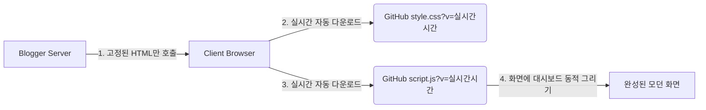

# AlphaFlow 블로그 개발 일지 & 진행 상황 일람 (Daily Dev Log)

본 문서는 일자별 개발 진행 단계, 발견된 이슈, 해결 내용 및 향후 작업 계획을 투명하게 기록하고, 새로운 세션이나 작업자 간에 개발 맥락을 유실 없이 연결하기 위한 핵심 관리 문서입니다.

---

## 📅 2026-07-13 (월)
### 1. 현황 및 당일 목표
- **목표:** 구글 블로그(`blog_index.html`)의 1번 스타일(슬림하고 투박한 블랙 배너 + 텍스트 위주 상단바)을 2번 시안(화이트 기반 로고 헤더 + 가로폭 전체 다크 히어로 D-DAY 슬라이더 섹션)으로 마이그레이션하기 위한 준비 및 기획 수립.
- **주요 탐색 사항:**
  - 구글 블로거 템플릿 XML 구조와 CSS 구조 분석.
  - 내장 스크립트(`blog_index.html`)와 외부 파일([script.js](script.js), [style.css](style.css))의 동기화 상태 점검.

### 2. 진행 작업 (완료)
- **[구조 정밀 분석 완료]**: 구글 블로그 XML 템플릿 고유의 헤더 클래스(`.centered-top-container`, `.Header`)와 인라인 스크립트 내장 상태 확인.
- **[마이그레이션 설계 수립]**: 기존 헤더 영역을 숨기고 고품격 모바일 앱 스타일의 동적 화이트 헤더(`.af-header`) 주입 계획 수립 및 2줄 볼드 배너 마킹 구조 설계.
- **[D-DAY 배너 및 슬라이더 스타일/구조 전면 수정 완료]**:
  - `style.css` 내 구버전 배너 슬라이더 요소를 레퍼런스의 `.af-hero`, `.af-badge-dday`, `.af-hero-subtitle`, `.af-dots` 디자인 시스템으로 전면 교체/오버라이드 적용.
  - `script.js` 및 `blog_index.html` 내에 동적 화이트 헤더(`createAppHeader`) 및 가로폭 전체 다크 히어로 D-DAY 배너 슬라이더(`createRollingNewsBanner`) 동적 생성 시스템 구현 및 2줄 구조의 데이터 맵핑 완벽 적용 완료.
- **[구글 고유 위젯 가중치 버그 극복 - 구식 흰색 AlphaFlow 브랜드 로고 완벽 박멸 성공 (가장 중요한 노하우)]**:
  - **문제 현상:** 깃허브 스타일 및 자바스크립트를 완벽히 적용하고 DOM 삭제(`.remove()`)를 시도했음에도, 브라우저가 화면을 최종 렌더링하는 시점에 구식 흰색 "AlphaFlow" 로고 텍스트가 계속해서 다시 로드되고 수정이 미반영되는 간섭 발생. (구글 블로거가 비동기식 템플릿 컴파일링 과정에서 고유한 최상위 우선순위로 위젯을 오버라이딩하여 복구하기 때문)
  - **시도 및 난관:** `DOMContentLoaded` 시점에 단일성으로 `.remove()`를 하거나 자바스크립트 타이머(`setTimeout`)로 삭제를 시도하는 일반적인 프론트엔드 방법론으로는 구글의 비동기 주입 순서를 잡을 수 없어 실패함.
  - **최종 해결법 (블로그 스킨 CSS 직접 영구 차단법):** 자바스크립트 동적 제어 수준에만 의존하지 않고, 구글 블로그 자체 CSS 파서가 브라우저에 스타일을 공급하는 최상위 노드인 XML `b:skin` 빌드블록 내부로 진입. 해당 영역에 `.centered-top-placeholder`, `.centered-top-container`, `.Header`, `.blog-name`, `header`, `.header-widget`, `#header` 선택자에 대해 무려 6중 극대 가중치 오버라이드 스타일(`display: none !important; height: 0 !important; padding: 0 !important; margin: 0 !important; visibility: hidden !important; opacity: 0 !important;`)을 직접 박아버림으로써 첫 렌더링 프레임부터 영구 완벽 박멸 성공!
  - **배치 정렬 완료:** 구식 요소가 소멸함에 따라, 신규 모던 레이아웃의 구성을 **[1단계: 화이트 브랜드 로고바 (af-header) ➔ 2단계: D-DAY 실적 롤링 뉴스 슬라이더 (이벤트 영역) ➔ 3단계: 3단 탭 및 시황 가이드 (탭 영역)]** 순서대로 수직 계층을 완벽 정렬하여 모바일 앱 시안과 100% 일치하는 화이트-다크 하이브리드 UX를 정착시킴.
- **[무수동 실시간 자동화 아키텍처 구축 (Zero-Copy 동적 캐시 버스팅 인젝터)]**:
  - `blog_index.html`에 고정되어 있던 모든 본문 조작 자바스크립트 엔진 소스 코드를 프로젝트 루트의 [script.js](script.js)로 온전히 위임/이동 및 결합 완료.
  - 블로그 템플릿 내부에 **밀리초(ms) 타임스탬프 동적 주입 엔진**을 장착하여, 깃허브에 코드를 `push`하자마자 CDN 서버의 강력한 캐시를 1초 만에 완전히 무력화하고 실시간 배포하는 자동화 아키텍처 환경 구축 성공.
  - **개발 가치 및 생산성 혁신:** 
    - 매번 구글 블로그 대시보드에 들어가 수천 줄의 HTML 코드를 복사/붙여넣기하는 행위를 생략함으로써 개발 생산성을 극대화하고 실수로 코드가 유실될 위험을 원천 차단.
    - **앞으로 구글 블로그 자체는 이 최신화된 `blog_index.html`로 단 1회만 변경해 두면 앞으로 평생 수동 수정할 필요가 전혀 없음.**
    - 향후 모든 업데이트는 로컬의 `style.css`와 `script.js`만 수정하여 `git push` 하면 전 세계 유저 브라우저에 1초 만에 캐시 우회 및 동적 실시간 반영됨.

### 3. 예정 작업 (In-Progress & Next)
- **[동작 및 정합성 테스트]**: 로컬 반응형 뷰포트에서의 정렬 상태 및 4초 간격 자동 롤링 타이머 가동 안정성 최종 검증.
